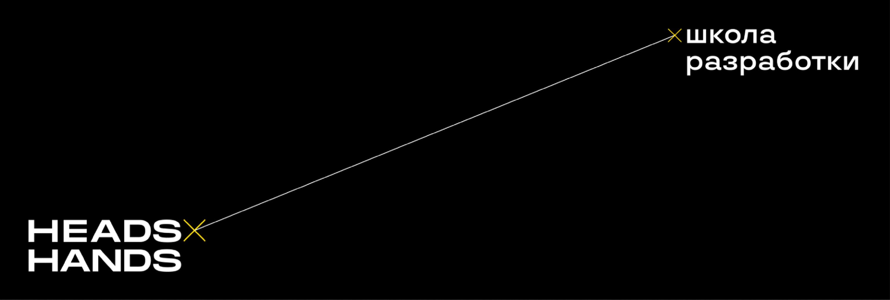

# Игра **_"Монстры против людей"_**
***

#### Привет, меня зовут Никита, и это мое тестовое задание!
В этой игре присутствует два героя: _Игрок Ник_ и _Монстр Боб_.

Главная задача каждого из них убить другого первым.

Однако, не все так просто)

Прежде, чем игрок атакует, он подбрасывает N-ное количество кубиков. В данном случае в качестве числа N выступает параметр Урона. Атака является успешной, если хотя бы на одном из кубиков выпадает 5 или 6.

Если Здоровье одного из игроков становится равным 0, то он может себя исцелить до 3-х раз на 50% от максимального Здоровья.

___
_P.s. Надеюсь, Вам понравится мое тестовое задание<3_